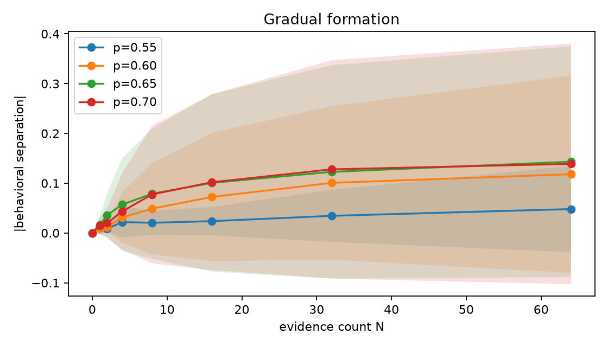
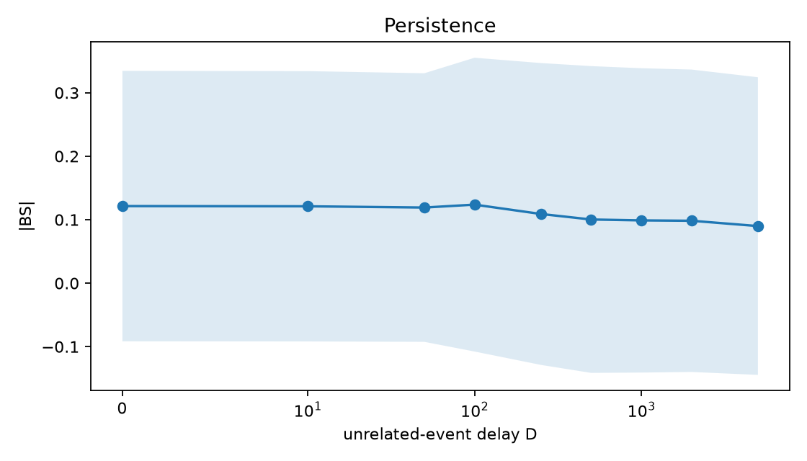
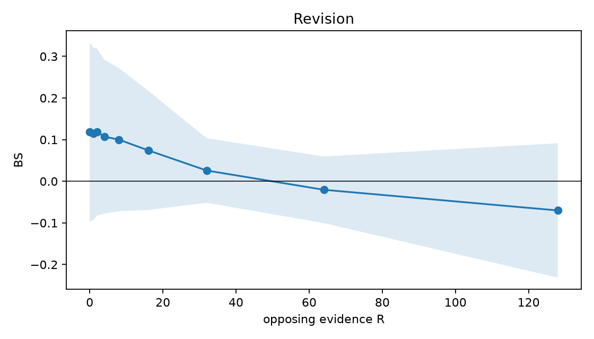
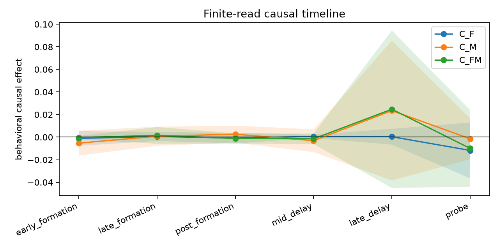
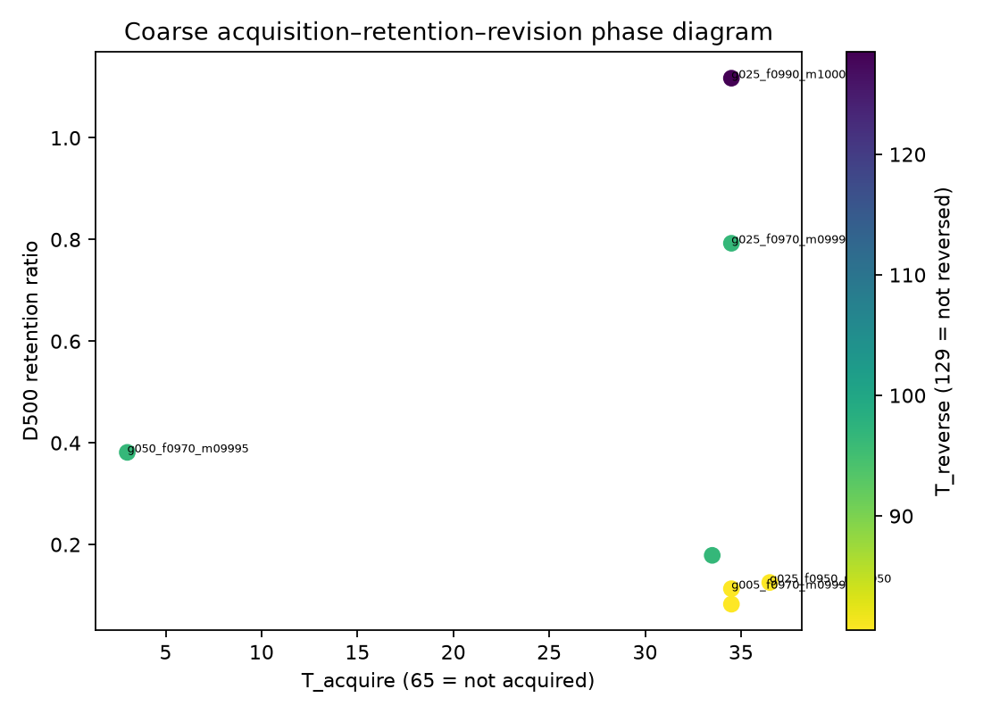
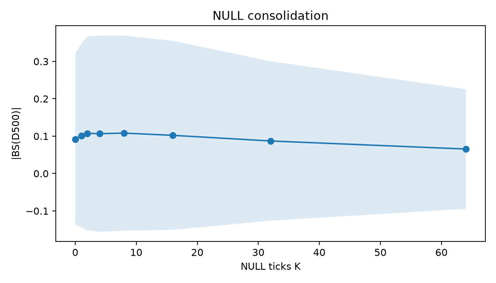
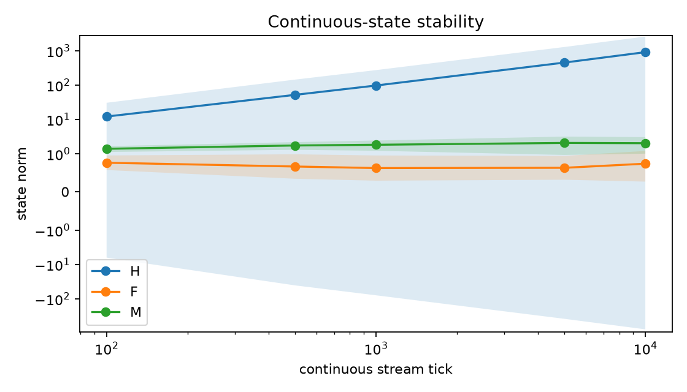

# ET-RCM Stage 2D — Gradual Behavioral Memory, Persistence–Plasticity, and Fast–Slow Causal Handoff

> **Once ET-RCM can form endogenous behavioral memory, can repeated uncertain experience gradually produce a persistent but revisable behavioral disposition, and does causal control shift from fast memory F toward slow memory M over time?**

> **在 ET-RCM 已经能够形成 endogenous behavioral memory 的基础上，重复而不确定的经验能否逐渐形成持久但可修正的行为倾向，并且这种行为的因果控制是否会随时间从 fast memory F 转移到 slow memory M？**

Formal outcome for the development-selected `g050_f0970_m09995` primary: **D — Plastic but fragile (or formation not replicated)**. G62=FAIL, G63=FAIL, G64=FAIL, G65=FAIL, G66=FAIL, G67=FAIL.

## 1. Experimental contract and implementation details

Stage 2D is additive: the Stage 2C.3 H/F/M transition, external delta write, learned reads, gated residual H integration, readout-conserving F→M transfer, decay, NULL and SELF_OUTPUT rules were not edited. A pre-write manifest verifies **1684 historical Stage 2C.x files unchanged**. Each noisy observation reveals a support bit equal to latent z with probability p, not z itself. Balanced paired actions preserve outcome marginal `[.5,1/6,1/6,1/6]`; matched noise is exactly paired and independent of z.

Development first retained the inherited 1,000-step 4/8/16 curriculum on seeds 7601–7602; it failed (near-zero BS). A development-only 1,500-step 16/32/64, p=.70 curriculum on 7611–7612 motivated the frozen formal schedule. The default γ=.12 configuration was run on eight formal seeds and remained a preserved negative result. The predeclared coarse sweep then identified `γ=.50,ρF=.97,ρM=.9995` as the only 2/2 health+acquisition-eligible shortlist; it was independently promoted to eight formal seeds, and G62–G67 below use those new seeds. Formal A2 uses 1,000 privileged evaluator-pretraining steps, freezes that head by hash, then uses 1,500 observed-consequence lifetime steps. z, correct action, reward, importance and memory labels never enter lifetime input/loss. Five independently trained seeds per control are retained; 24–32 paired within-seed replicas only reduce Monte Carlo noise. Every formal/sweep job ran on CPU with `torch.set_num_threads(1)`; jobs were process-parallel, so there is no mixed GPU/CPU backend confound.

Formation N=0/1/2/4/8/16/32/64 at p=.55/.60/.65/.70; persistence D=0/10/50/100/250/500/1000/2000/5000; reversal R=0/1/2/4/8/16/32/64/128; opposing fraction q=0/.1/.25/.5/.75/1; NULL K=0/1/2/4/8/16/32/64. D*=500, formation/acquisition threshold=.10, persistence ratio=.20, selectivity margin=.05 and consolidation margin=.03 were frozen before formal training. Read clamps preserve state; zero/swap interventions destroy/replace state and are reported separately.

## 2. Development audit (excluded from formal gates)

| curriculum | seed | steps | train p | final train CE | BS N1 | BS N32 | BS D500 |
|---|---:|---:|---:|---:|---:|---:|---:|
| short inherited | 7601 | 1000 | 0.65 | 1.2432 | +0.0108 | -0.0010 | +0.0004 |
| short inherited | 7602 | 1000 | 0.65 | 1.2330 | -0.0052 | -0.0072 | -0.0030 |
| long noisy | 7611 | 1500 | 0.70 | 1.1876 | -0.0086 | -0.0015 | +0.0003 |
| long noisy | 7612 | 1500 | 0.70 | 1.1595 | +0.0003 | +0.0037 | -0.0204 |

## 3. Gates

| Gate | Result | Replication | Frozen criterion |
|---|---|---:|---|
| G62 gradual accumulation | FAIL | 2/8 | late > middle > early bands |
| G63 long persistence | FAIL | 2/8 | meaningful BS0 and D500/0 ≥ .20 |
| G64 revisability | FAIL | 2/8 | reversed by R≤128 |
| G65 predictive selectivity | FAIL | 2/8 | delayed predictive > matched noise + .05 |
| G66 F→M causal handoff | FAIL | 2/8 | finite read-effect crossover with meaningful baseline |
| G67 consolidation benefit | FAIL | 0/5 | no acquisition damage and retention +.03 or late-M +.02 |

Passing seeds: `{"G62": [7801, 7804], "G63": [7801, 7804], "G64": [7801, 7804], "G65": [7801, 7804], "G66": [7801, 7804], "G67": []}`.
Healthy noisy-world interface seeds (development-frozen action-TV≥.10 and interaction≥.10): `[7801, 7804]`. CFA remains reported, but its deterministic-world .10 threshold is not copied because noisy evidence lowers the theoretical ceiling. All G62–G67 claims require the two binding prerequisites within the same seed.

## 4. Gradual formation and Bayesian reference

| p | N0 | N1 | N2 | N4 | N8 | N16 | N32 | N64 | T_acquire | calibration Brier N32 |
|---:|---:|---:|---:|---:|---:|---:|---:|---:|---:|---:|
| 0.55 | 0.000 ± 0.000 | -0.006 ± 0.018 | -0.001 ± 0.012 | 0.002 ± 0.039 | 0.018 ± 0.026 | 0.021 ± 0.031 | 0.020 ± 0.060 | 0.036 ± 0.093 | 32.000 ± 0.000 | 0.056 ± 0.029 |
| 0.60 | 0.000 ± 0.000 | -0.001 ± 0.014 | 0.006 ± 0.014 | 0.025 ± 0.055 | 0.043 ± 0.095 | 0.068 ± 0.131 | 0.077 ± 0.169 | 0.101 ± 0.209 | 10.000 ± 8.485 | 0.145 ± 0.067 |
| 0.65 | 0.000 ± 0.000 | 0.014 ± 0.020 | 0.032 ± 0.048 | 0.054 ± 0.095 | 0.068 ± 0.137 | 0.099 ± 0.179 | 0.122 ± 0.215 | 0.125 ± 0.243 | 3.000 ± 1.414 | 0.181 ± 0.073 |
| 0.70 | 0.000 ± 0.000 | 0.004 ± 0.022 | 0.011 ± 0.035 | 0.043 ± 0.077 | 0.063 ± 0.146 | 0.100 ± 0.178 | 0.122 ± 0.223 | 0.130 ± 0.247 | 6.000 ± 2.828 | 0.202 ± 0.089 |

Primary band means: early `0.014 ± 0.013`, middle `0.050 ± 0.089`, late `0.101 ± 0.169`. The Bayesian reference is computed from the known likelihood and is never a training target. Single-event posterior is p rather than 0/1; N1 saturation is assessed directly above.

## 5. Persistence and descriptive fits

| D | 0 | 10 | 50 | 100 | 250 | 500 | 1000 | 2000 | 5000 |
|---|---:|---:|---:|---:|---:|---:|---:|---:|---:|
| mean BS | 0.118 ± 0.215 | 0.118 ± 0.215 | 0.117 ± 0.213 | 0.113 ± 0.238 | 0.108 ± 0.238 | 0.097 ± 0.243 | 0.099 ± 0.240 | 0.096 ± 0.239 | 0.090 ± 0.235 |

Per-seed half-lives: `['>5000', 50, 100, 250, '>5000', 50, 500, 250]`; no extrapolation is used. A half-life is scientifically interpretable only for a seed with preregistered meaningful BS(0); otherwise it is merely a small-signal crossing diagnostic. Descriptive exponential log-R² `0.474 ± 0.258`, power-like log-R² `0.631 ± 0.261`. Bi-exponential fitting was attempted but was underidentified/unstable with nine noisy points and is not interpreted.

## 6. Reversal, contradiction and hysteresis

| R | 0 | 1 | 2 | 4 | 8 | 16 | 32 | 64 | 128 |
|---|---:|---:|---:|---:|---:|---:|---:|---:|---:|
| mean BS | 0.118 ± 0.215 | 0.114 ± 0.207 | 0.118 ± 0.201 | 0.107 ± 0.185 | 0.100 ± 0.172 | 0.074 ± 0.143 | 0.026 ± 0.078 | -0.020 ± 0.080 | -0.070 ± 0.161 |

T_change `[32, 2, None, 32, None, 16, 32, None]`; T_neutral `[64, 8, 16, 128, 4, 16, 32, 2]`; T_reverse `[64, 'NOT_REVERSED_WITHIN_RANGE', 'NOT_REVERSED_WITHIN_RANGE', 128, 'NOT_REVERSED_WITHIN_RANGE', 'NOT_REVERSED_WITHIN_RANGE', 'NOT_REVERSED_WITHIN_RANGE', 'NOT_REVERSED_WITHIN_RANGE']`.

| opposing fraction q | 0 | .10 | .25 | .50 | .75 | 1.0 |
|---|---:|---:|---:|---:|---:|---:|
| BS after 64 mixed events | 0.135 ± 0.241 | 0.134 ± 0.236 | 0.137 ± 0.223 | 0.101 ± 0.185 | 0.066 ± 0.101 | -0.021 ± 0.085 |

## 7. Predictive selectivity and rare-useful control

| Condition | immediate BS | D500 BS |
|---|---:|---:|
| matched predictive | 0.112 ± 0.210 | 0.100 ± 0.252 |
| matched noise | 0.000 ± 0.000 | 0.000 ± 0.000 |

Rare/frequent immediate BS: `useful_4=0.068 ± 0.123`, `useful_8=0.089 ± 0.161`, `noise_32=0.000 ± 0.000`, `noise_64=0.000 ± 0.000`, `noise_128=0.000 ± 0.000`.

## 8. F/M causal timeline

| Time | C_F read | C_M read | C_FM read | F-zero | M-zero | F-swap | M-swap |
|---|---:|---:|---:|---:|---:|---:|---:|
| early_formation | -0.001 ± 0.007 | -0.005 ± 0.011 | -0.000 ± 0.001 | -0.005 ± 0.010 | 0.012 ± 0.031 | -0.001 ± 0.008 | 0.073 ± 0.191 |
| late_formation | 0.001 ± 0.004 | 0.001 ± 0.008 | 0.002 ± 0.007 | -0.001 ± 0.008 | 0.080 ± 0.182 | -0.004 ± 0.009 | 0.199 ± 0.507 |
| post_formation | -0.001 ± 0.005 | 0.003 ± 0.008 | -0.001 ± 0.005 | -0.003 ± 0.006 | 0.087 ± 0.210 | -0.005 ± 0.011 | 0.216 ± 0.524 |
| mid_delay | 0.001 ± 0.001 | -0.003 ± 0.010 | -0.001 ± 0.005 | -0.000 ± 0.003 | 0.129 ± 0.341 | 0.000 ± 0.004 | 0.212 ± 0.527 |
| late_delay | 0.000 ± 0.007 | 0.024 ± 0.062 | 0.025 ± 0.070 | -0.012 ± 0.025 | -0.012 ± 0.046 | -0.018 ± 0.050 | -0.005 ± 0.038 |
| probe | -0.012 ± 0.025 | -0.001 ± 0.018 | -0.010 ± 0.034 | -0.012 ± 0.025 | -0.012 ± 0.046 | -0.018 ± 0.050 | -0.005 ± 0.038 |

Read mediation and state destruction are not conflated. G66 uses only finite read clamps and baseline behavior. Norm crossovers are not counted.

## 9. Independently trained baselines

| Arm | seeds | BS N32 p=.65 | persistence ratio D500 | T_reverse finite | delayed predictive | delayed noise |
|---|---:|---:|---:|---:|---:|---:|
| A2 selected g050 | 8 | 0.122 ± 0.215 | 0.817 ± 0.859 | 2/8 | 0.100 ± 0.252 | 0.000 ± 0.000 |
| A2 default g012 | 8 | 0.001 ± 0.007 | NOT_ELIGIBLE | 0/8 | -0.000 ± 0.002 | 0.000 ± 0.000 |
| a0 | 5 | 0.002 ± 0.003 | NOT_ELIGIBLE | 0/5 | 0.000 ± 0.001 | 0.000 ± 0.000 |
| gamma_zero | 5 | 0.003 ± 0.003 | NOT_ELIGIBLE | 0/5 | -0.000 ± 0.000 | 0.000 ± 0.000 |
| f_only | 5 | 0.001 ± 0.007 | NOT_ELIGIBLE | 0/5 | 0.002 ± 0.004 | 0.000 ± 0.000 |
| f_only_g050 | 5 | 0.158 ± 0.220 | 0.013 ± 0.013 | 2/5 | 0.002 ± 0.005 | 0.000 ± 0.000 |
| no_memory | 5 | 0.083 ± 0.176 | 0.054 ± 0.000 | 1/5 | 0.005 ± 0.011 | 0.000 ± 0.000 |
| gru | 5 | 0.002 ± 0.003 | NOT_ELIGIBLE | 0/5 | 0.000 ± 0.000 | 0.000 ± 0.000 |

Allocated parameter budgets: `{'full': 27817, 'gamma_zero': 27817, 'f_only': 27817, 'no_memory': 27817, 'gru': 27817}`. All variants retain compatibility modules even when reads/transfer are disabled; this is a functional—not compute-efficiency—comparison. Every control checkpoint was trained independently.

## 10. Coarse γ/ρ phase diagram

| config | γ | ρF | ρM | T_acquire | T1/2 | T_reverse | retention D500 | late C_F | late C_M | health | shortlist | Pareto |
|---|---:|---:|---:|---:|---:|---:|---:|---:|---:|---:|---|---|
| g000_f0970_m09995 | 0.00 | 0.970 | 0.9995 | 65.0 | 10.0 | 129.0 | nan | -0.000 | +0.000 | 0/2 | False | True |
| g005_f0950_m09950 | 0.05 | 0.950 | 0.9950 | 65.0 | 10.0 | 129.0 | nan | +0.000 | +0.000 | 0/2 | False | True |
| g005_f0970_m09995 | 0.05 | 0.970 | 0.9995 | 34.5 | 50.0 | 80.5 | 0.113 | -0.000 | -0.000 | 0/2 | False | True |
| g005_f0990_m10000 | 0.05 | 0.990 | 1.0000 | 34.5 | 30.0 | 80.5 | 0.083 | -0.001 | +0.001 | 0/2 | False | False |
| g012_f0900_m09900 | 0.12 | 0.900 | 0.9900 | 33.5 | 75.0 | 129.0 | nan | -0.000 | -0.000 | 1/2 | False | True |
| g012_f0950_m09950 | 0.12 | 0.950 | 0.9950 | 33.5 | 150.0 | 96.5 | 0.179 | -0.001 | +0.007 | 1/2 | False | False |
| g012_f0970_m09995 | 0.12 | 0.970 | 0.9995 | 65.0 | 50.0 | 129.0 | nan | +0.000 | -0.000 | 0/2 | False | True |
| g012_f0990_m10000 | 0.12 | 0.990 | 1.0000 | 65.0 | 30.0 | 129.0 | nan | +0.000 | -0.000 | 0/2 | False | True |
| g025_f0950_m09950 | 0.25 | 0.950 | 0.9950 | 36.5 | 30.0 | 80.5 | 0.125 | -0.000 | +0.000 | 1/2 | False | True |
| g025_f0970_m09995 | 0.25 | 0.970 | 0.9995 | 34.5 | 2505.5 | 96.5 | 0.793 | +0.000 | +0.012 | 1/2 | False | True |
| g025_f0990_m10000 | 0.25 | 0.990 | 1.0000 | 34.5 | 2505.5 | 128.5 | 1.117 | -0.000 | +0.012 | 1/2 | False | True |
| g050_f0970_m09995 | 0.50 | 0.970 | 0.9995 | 3.0 | 1125.0 | 96.5 | 0.381 | -0.000 | +0.011 | 2/2 | True | True |

Phase-table sentinels: T_acquire=65 means not acquired by N64; T1/2=5001 means >5000 (not extrapolated); T_reverse=129 means not reversed by R128.

Development-selected configuration: `g050_f0970_m09995`. A configuration is promoted only if both development seeds pass interface health and acquire by N64. The selected g050 configuration was independently promoted to eight formal seeds; the default eight-seed negative result was not overwritten. The table, not a single scalar, is the scientific result; infinite retention with failed revision is not treated as optimal.

## 11. NULL consolidation and continuous operation

| K NULL | immediate BS | D500 BS | cumulative transfer | probe C_F | probe C_M |
|---:|---:|---:|---:|---:|---:|
| 0 | 0.096 ± 0.195 | 0.090 ± 0.230 | 0.000 ± 0.000 | 0.007 ± 0.015 | 0.036 ± 0.075 |
| 1 | 0.113 ± 0.198 | 0.101 ± 0.246 | 0.019 ± 0.011 | 0.006 ± 0.021 | 0.053 ± 0.077 |
| 2 | 0.112 ± 0.208 | 0.099 ± 0.263 | 0.034 ± 0.017 | 0.013 ± 0.023 | 0.049 ± 0.075 |
| 4 | 0.102 ± 0.219 | 0.104 ± 0.264 | 0.056 ± 0.024 | 0.007 ± 0.017 | 0.045 ± 0.077 |
| 8 | 0.103 ± 0.203 | 0.103 ± 0.263 | 0.084 ± 0.034 | 0.004 ± 0.021 | 0.047 ± 0.079 |
| 16 | 0.093 ± 0.173 | 0.102 ± 0.253 | 0.123 ± 0.050 | 0.014 ± 0.025 | 0.047 ± 0.069 |
| 32 | 0.074 ± 0.150 | 0.087 ± 0.213 | 0.161 ± 0.068 | 0.018 ± 0.041 | 0.026 ± 0.034 |
| 64 | 0.034 ± 0.127 | 0.065 ± 0.160 | 0.189 ± 0.083 | 0.022 ± 0.036 | 0.002 ± 0.057 |

| stream tick | H norm | F norm | M norm | BS | mean ΔH |
|---:|---:|---:|---:|---:|---:|
| 100 | 12.155 ± 18.473 | 0.766 ± 0.191 | 1.400 ± 0.270 | 0.075 ± 0.112 | 0.866 ± 0.160 |
| 500 | 52.003 ± 92.558 | 0.667 ± 0.320 | 1.748 ± 0.440 | 0.016 ± 0.087 | 0.863 ± 0.144 |
| 1000 | 97.284 ± 176.146 | 0.626 ± 0.330 | 1.832 ± 0.607 | 0.007 ± 0.061 | 0.860 ± 0.149 |
| 5000 | 452.333 ± 833.459 | 0.633 ± 0.312 | 2.072 ± 1.102 | 0.016 ± 0.041 | 0.863 ± 0.154 |
| 10000 | 911.136 ± 1683.629 | 0.741 ± 0.470 | 2.037 ± 1.026 | 0.030 ± 0.074 | 0.863 ± 0.153 |

First H>100: `[None, 169, None, None, None, None, None, 281]`; first H>1000: `[None, 1982, None, None, None, None, None, 2827]`; first NaN/Inf: `[None, None, None, None, None, None, None, None]`. No Stage 2D H scaling or recurrence repair was applied.

## 12. Training health

| seed | action-TV | history-TV | interaction | conditional CE | CFA | H/F/M probe accuracy | read gate F/M | H/F/M norm |
|---:|---:|---:|---:|---:|---:|---|---|---|
| 7801 | 0.344 | 0.344 | +0.687 | 1.199 | +0.043 | {'H': 1.0, 'F': 0.75, 'M': 1.0} | [0.264, 0.736] | {'H': 3.3498682975769043, 'F': 0.47723791003227234, 'M': 1.1439073085784912} |
| 7802 | 0.082 | 0.007 | -0.015 | 1.255 | -0.012 | {'H': 0.5, 'F': 0.625, 'M': 0.53125} | [0.555, 0.445] | {'H': 29.83973503112793, 'F': 0.686347484588623, 'M': 1.009239912033081} |
| 7803 | 0.047 | 0.023 | +0.015 | 1.242 | +0.001 | {'H': 0.4375, 'F': 0.5625, 'M': 0.5625} | [0.795, 0.205] | {'H': 3.4982211589813232, 'F': 0.5370113849639893, 'M': 1.2916357517242432} |
| 7804 | 0.258 | 0.258 | +0.516 | 1.198 | +0.045 | {'H': 0.875, 'F': 0.6875, 'M': 0.90625} | [0.266, 0.734] | {'H': 1.7991385459899902, 'F': 0.4573895037174225, 'M': 1.223508358001709} |
| 7805 | 0.019 | 0.006 | +0.012 | 1.241 | +0.001 | {'H': 0.5, 'F': 0.59375, 'M': 0.5} | [0.59, 0.41] | {'H': 2.1171650886535645, 'F': 0.6356208324432373, 'M': 1.14215886592865} |
| 7806 | 0.224 | 0.062 | -0.103 | 1.292 | -0.050 | {'H': 0.5625, 'F': 0.46875, 'M': 0.4375} | [0.662, 0.338] | {'H': 0.939912736415863, 'F': 0.24096132814884186, 'M': 1.5280345678329468} |
| 7807 | 0.050 | 0.010 | -0.006 | 1.245 | -0.003 | {'H': 0.53125, 'F': 0.59375, 'M': 0.4375} | [0.525, 0.475] | {'H': 1.9893308877944946, 'F': 0.38459762930870056, 'M': 1.378609299659729} |
| 7808 | 0.057 | 0.002 | +0.003 | 1.248 | -0.006 | {'H': 0.5, 'F': 0.5, 'M': 0.40625} | [0.834, 0.166] | {'H': 20.779233932495117, 'F': 0.8248440027236938, 'M': 1.012789249420166} |

Evaluator hashes, q norms, gradient groups, training CE curves, write/transfer traces and every seed-level probability are preserved in checkpoints, summaries and processed JSON. Action-TV, interaction and CFA are health prerequisites; a memory-dynamics pattern is not promoted when this interface is unhealthy.

## 13. Direct answers to the 28 required questions

1. Noisy-evidence formation was not replicated (2/8 ordering seeds).
2. Single experience mean |BS| was 0.016; compare N32 0.123.
3. Direction/calibration relative to Bayes is reported in the p×N table; Bayes was reference-only.
4. Evidence-reliability T_acquire by p was {'0.55': [32, None, None, None, None, None, None, None], '0.60': [4, None, None, 16, None, None, None, None], '0.65': [2, None, None, 4, None, None, None, None], '0.70': [4, None, None, 8, None, None, None, None]}; NOT_ACQUIRED is retained as null rather than imputed.
5. Per-seed numerical half-life is ['>5000', 50, 100, 250, '>5000', 50, 500, 250]; values beyond 5000 are bounds, and seeds without meaningful BS0 do not support a memory half-life claim.
6. Long-delay persistence passed in 2/8 seeds.
7. Opposing evidence produced criterion reversal in 2/8 seeds.
8. Per-seed reversal times are [64, 'NOT_REVERSED_WITHIN_RANGE', 'NOT_REVERSED_WITHIN_RANGE', 128, 'NOT_REVERSED_WITHIN_RANGE', 'NOT_REVERSED_WITHIN_RANGE', 'NOT_REVERSED_WITHIN_RANGE', 'NOT_REVERSED_WITHIN_RANGE'].
9. Hysteresis is present only for seeds whose reversal time exceeds their acquisition time; the paired T_acquire/T_reverse arrays above show whether that occurred.
10. Matched-noise selectivity passed in 2/8 seeds.
11. Rare useful N8 mean |BS|=0.091 versus frequent noise N128=0.000; raw frequency is not relabeled as utility.
12. F finite-read causal effect was largest at mid_delay (seed mean +0.001).
13. M finite-read causal effect was largest at late_delay (seed mean +0.024); state norms were not substituted.
14. A replicated behavioral F→M crossover was not found (2/8).
15. Gamma-zero consolidation benefit adjudication was FAIL (0/5); full-minus-gamma0 D500 retention ratio=NOT_COMPARABLE_NO_MATCHED_FORMED_PAIRS.
16. Full-minus-gamma0 late-delay M causal effect=+0.038; per-seed values are preserved.
17. The descriptive balanced phase region was g050_f0970_m09995; all trade-offs are shown in the phase table.
18. The measured system is classified as too plastic/fragile; if formation itself fails, Outcome D is only the closest required category and is not evidence of genuine plastic memory.
19. NULL K16 versus K0 D500 BS: 0.102 ± 0.253 versus 0.090 ± 0.230.
20. NULL K16 minus K0 long-delay |BS| was +0.010; a functional F→M shift is claimed only if this gain accompanies the reported causal redistribution.
21. NULL-driven H drift without retention is classified as non-useful internal time, not consolidation success.
22. 10k stability: nonfinite in 0/8; H>1000 in 2/8.
23. Across the 2 retention-eligible completed 10k runs, Pearson corr(H norm, D500 retention ratio)=+1.000; this tiny-n diagnostic is not inferential. Drift is called a confound only with failed/nonfinite adjudication, and raw trajectories are retained.
24. Stage 2G stable-H redesign is not yet forced by the stopping rule.
25. Memory-law redesign is not yet justified: two formal seeds exhibit the targeted formation/persistence/reversal/handoff chain, while the dominant failure is across-seed learning robustness, not proof that the F→M law cannot work.
26. Data-dependent consolidation is not introduced in Stage 2D; first improve reproducible noisy-world binding without changing the law, then retest the phase region.
27. Natural-online training is not supported by the full gate set.
28. Natural-language behavioral memory is premature; resolve the reported failure first.

## 14. Verification

- Stage 2D unit tests: **21/21 passed**.
- Repository suite: **167/168 passed**. The sole failure is the inherited Stage 1.5 guard that compares `README.md` to commit `1367110`; README has intentionally accumulated later-stage result links. No Stage 2D mathematical, leakage, intervention, frozen-evaluator, or integrity test failed.
- Historical Stage 2C.x manifest: **1684/1684 unchanged**.
- Formal training: 8 selected primary + 8 default primary + 5 each for A0/gamma-zero/original-F-only/matched-F-only/no-memory/GRU; all checkpoints completed and all evaluation parameter hashes were frozen.
- Required report exists and is non-empty at `/data/CSK/ETPM/et-rcm/reports/STAGE2D_MEMORY_DYNAMICS_RESULTS.md`.

## 15. Scientific conclusion and stopping rule

**D — Plastic but fragile (or formation not replicated).** If formation is not replicated, this is the closest category in the required A–E taxonomy, not evidence that a real memory was 'plastic'. Toy/Stage-2D success is not human-like memory, consciousness, infinite capacity or causal memory in the unrestricted sense. NULL improvement, if any, means only a measured benefit in this synthetic world. Failed and null gates are retained. The core memory law should be changed only after reasonable γ/ρ regions fail the joint acquisition–retention–revision and causal-handoff tests; continuous instability instead routes to the separately authorized Stage 2G stable-H study.

Machine-readable root: `results/stage2d/processed/summary.json`. Full seed records remain in `results/stage2d/processed/formal/`; source and historical integrity hashes are in `results/stage2d/manifests/`.
